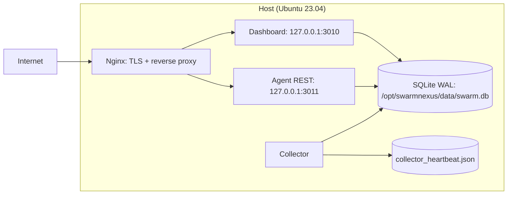

<p align="center">
  
</p>

# Swarm Nexus
where the swarm converges, patterns emerge. From secrets to prophecy.

Swarm Nexus production system as deployed today: what runs, where it runs, how the components interact, and how we operate and maintain it. This is a runbook and system overview.

---

## 1) Current Production Topology

- Host
  - Ubuntu 23.04 (GNU/Linux 6.2.0-39-generic x86_64)
  - Live domain: https://swarm-nexus.xyz (Nginx terminates TLS via Let’s Encrypt)
- Data store
  - SQLite in WAL mode
  - Canonical file: /opt/swarmnexus/data/swarm.db
- Services (local)
  - Dashboard (Flask/Gunicorn) on 127.0.0.1:3010 (proxied at /)
  - Agent REST (Node/Hono) on 127.0.0.1:3011 (proxied at /agent/)
  - Torus Agent (Node) available on 3012 when enabled (not proxied)
  - Collector (Node + Puppeteer) scrapes X mentions/replies; writes to SQLite
- Timers (systemd)
  - Compressed DB backup every ~2 days (retention default 14 days)
  - Heartbeat watcher every 5 minutes (warns if stale; optional auto-restart)
- Versions (current)
  - Node.js (www-data): v22.18.0
  - Python (Dashboard venv): 3.11.4
  - SQLite: WAL mode active

Mermaid (topology)


---

## 2) Repositories and Layout

- Repos (GitHub)
  - SwarmNexus-PROD (this repo): operational home, Nginx/systemd assets, runbook, timers
  - SwarmNexus-Dashboard: Flask UI + JSON APIs (read-only DB)
  - SwarmNexus-Agent: Node memory APIs (REST + optional Torus; read-only DB)
  - SwarmNexus-Collector: Node + Puppeteer scraper (writer)
- Filesystem (host)
  - /opt/swarmnexus/dashboard  → Dashboard submodule checkout
  - /opt/swarmnexus/agent      → Agent submodule checkout
  - /opt/swarmnexus/collector  → Collector submodule checkout
  - /opt/swarmnexus/data       → swarm.db (WAL), runtime data, cookies
  - /opt/swarmnexus/scripts    → operational scripts (backup, heartbeat watch)
  - /etc/nginx/sites-available/swarm-nexus.conf → live proxy config
  - /etc/systemd/system/*.service|*.timer → live units

---

## 3) Data Flow (end-to-end)

1) Collector
   - Logs into X using cookies (sacrificial scraping account recommended).
   - Source: notifications (production), polling every 60s, cap 80 mentions/cycle.
   - Fully hydrates threads, extracts $TICKERs, parses call metadata.
   - Upserts into SQLite:
     - predictions: mention + parent context, URLs/timestamps, asset/target_date/status
     - tickers: per-ticker rows linked by tweet_id
   - Writes heartbeat JSON after each successful cycle:
     - /opt/swarmnexus/data/collector_heartbeat.json { ts, lastSource, handle }

2) Readers
   - Dashboard (Flask) and Agent (Node) open DB in read-only mode.
   - Dashboard provides UI, evals, NLP preview, and social content features.
   - Agent exposes REST endpoints (and Torus Agent optionally) for programmatic access.

3) Reverse proxy
   - Nginx terminates TLS for https://swarm-nexus.xyz and proxies:
     - / → 127.0.0.1:3010
     - /agent/ → 127.0.0.1:3011

---

## 4) Database and Schema

- File: /opt/swarmnexus/data/swarm.db
- Mode: WAL (confirmed via PRAGMA journal_mode=wal)
- Core tables:
  - predictions
    - tweet_id (unique), author_handle, text, asset, target_date, status, created_at
    - parent_tweet_id, parent_author_handle, parent_text
    - tweet_created_at, parent_created_at, tweet_url, parent_tweet_url
  - tickers
    - ticker, tweet_id, mention_author_handle, parent_author_handle
    - tweet_created_at, parent_created_at, tweet_url, parent_tweet_url
- Additional (Dashboard-driven as used)
  - prediction_nlp_labels, nlp_models, evaluations, helper views/caches
  - Optional prices and views (e.g., prices_norm)

Backups and retention
- Compressed snapshots at /opt/swarmnexus/backups/swarm-YYYY-MM-DD-HHMM.db.gz
- Timer (OnUnitActiveSec=2d) with default 14-day retention (configurable)

Maintenance
- Periodic VACUUM/ANALYZE during low activity after temporarily stopping the Collector.

---

## 5) Services (systemd)

Collector
- Unit: /etc/systemd/system/swarm-collector.service (+ override.conf)
- WorkingDirectory: /opt/swarmnexus/collector
- Environment: /opt/swarmnexus/collector/.env (production values in use)
  - SOURCE=notifications
  - POLL_SECONDS=60
  - MAX_MENTIONS_PER_CYCLE=80
  - BACKOFF_BASE_MS=120000, BACKOFF_MAX_MS=600000
  - TW_COOKIES_PATH=twitter-cookies.json → symlink → /opt/swarmnexus/data/twitter-cookies.json
- Overrides in place (Puppeteer caches/executable path, XDG dirs)
- Heartbeat file: /opt/swarmnexus/data/collector_heartbeat.json

Dashboard (Flask/Gunicorn)
- Unit: /etc/systemd/system/swarm-dashboard.service (+ env drop-in)
- WorkingDirectory: /opt/swarmnexus/dashboard
- Exec: gunicorn -w 3 -b 127.0.0.1:3010 app:app
- Optional env drop-ins for SOCIAL_* / MEDIUM_RSS / GCAL_ICS_URL

Agent (REST)
- Unit: /etc/systemd/system/swarm-agent.service
- WorkingDirectory: /opt/swarmnexus/agent
- Exec: node /opt/swarmnexus/agent/server.js (port 3011)
- Env: /opt/swarmnexus/agent/.env (DB_PATH=/opt/swarmnexus/data/swarm.db, PORT=3011)

---

## 6) Reverse Proxy (Nginx)

- Site file: /etc/nginx/sites-available/swarm-nexus.conf (symlinked into sites-enabled)
- TLS: Let’s Encrypt paths
- Routes
  - / → 127.0.0.1:3010 (Dashboard)
  - /agent/ → 127.0.0.1:3011 (Agent REST)
- gzip enabled for common web types
- certbot.timer active on host for renewals

---

## 7) Health, Monitoring, and Timers

Heartbeats
- Source: /opt/swarmnexus/data/collector_heartbeat.json
- Watcher (systemd):
  - swarm-heartbeat-watch.service (oneshot)
  - swarm-heartbeat-watch.timer (every 5 minutes, randomized)
  - Default threshold: 10 minutes (600s)
  - Optional: auto-restart Collector when stale (RESTART_IF_STALE=1 via drop-in)

Backups
- Script: /opt/swarmnexus/scripts/db_backup.sh
- Units:
  - swarm-db-backup.service (oneshot)
  - swarm-db-backup.timer (OnUnitActiveSec=2d, randomized)
- Output: /opt/swarmnexus/backups/*.db.gz
- Default retention: 14 days (RETENTION_DAYS)

---

## 8) APIs (as deployed)

Dashboard (selected)
- GET /api/evals/leaderboard?window=12h|24h|7d|30d&min_calls=3
- GET /api/evals/author?handle=<handle>&window=24h
- GET /api/evals/preview?limit=200..2000
- GET /api/evals/nlp

Agent (REST)
- GET /healthz
- GET /capabilities
- GET /openapi.yaml
- GET /memory/mentions?limit&since&until&author&ticker&q
- GET /memory/tickers?ticker&limit

Torus Agent (optional)
- Runs at 3012 (when enabled), serves OpenAPI at /docs

---

## 9) Operations: Day-to-day

Logs
- Collector: journalctl -u swarm-collector -f
- Dashboard: journalctl -u swarm-dashboard -f
- Agent: journalctl -u swarm-agent -f
- Heartbeat watcher: journalctl -u swarm-heartbeat-watch.service -n 50 --no-pager
- Backups: journalctl -u swarm-db-backup -n 50 --no-pager

Quick checks
```bash
# Public health
curl -I https://swarm-nexus.xyz/agent/healthz

# Who are we logged in as? Which collector source?
cat /opt/swarmnexus/data/collector_heartbeat.json | jq
journalctl -u swarm-collector -n 200 --no-pager | grep -i "Logged in as"

# Throttle knobs in effect
grep -E '^(SOURCE|POLL_SECONDS|MAX_MENTIONS_PER_CYCLE|POLL_JITTER|BACKOFF_BASE_MS|BACKOFF_MAX_MS)=' /opt/swarmnexus/collector/.env

# Timers
systemctl list-timers | egrep 'swarm-db-backup|swarm-heartbeat'
```

---

## 10) Security Posture (production reality)

- Scraping account: Use a sacrificial X account; X is aggressive with automated scraping.
- Cookie file
  - Path: /opt/swarmnexus/data/twitter-cookies.json (symlinked into /opt/swarmnexus/collector)
  - Recommended perms: www-data:swarm, 0640
- Read-only readers
  - Dashboard/Agent open the DB read-only to avoid writer interference/corruption.
- Exposure
  - Services listen on 127.0.0.1; Nginx handles TLS and external exposure.

---

## 11) Updating the System (code and config)

Submodules flow
1) Update service repos (Dashboard/Collector/Agent) in their own repos (PR → main).
2) In SwarmNexus-PROD:
   - git checkout a working branch (e.g., readme-update)
   - cd each submodule → git checkout main && git pull
   - git add dashboard collector agent && git commit -m "Update submodules"
   - git push; open PR for SwarmNexus-PROD; merge

Deploying changes on host
```bash
cd /opt/swarmnexus
git checkout main
git pull
git submodule update --init --recursive

# Restart impacted services (examples)
sudo systemctl restart swarm-dashboard
sudo systemctl restart swarm-agent
sudo systemctl restart swarm-collector
```

---

## 12) Appendix: Paths and Units (at a glance)

- DB
  - /opt/swarmnexus/data/swarm.db (WAL)
  - Backups: /opt/swarmnexus/backups/*.db.gz
- Collector
  - /opt/swarmnexus/collector/.env
  - symlink: /opt/swarmnexus/collector/twitter-cookies.json → /opt/swarmnexus/data/twitter-cookies.json
- Timers
  - swarm-db-backup.service / .timer
  - swarm-heartbeat-watch.service / .timer
- Nginx
  - /etc/nginx/sites-available/swarm-nexus.conf (linked into sites-enabled)
  - certbot.timer active for renewals

---
